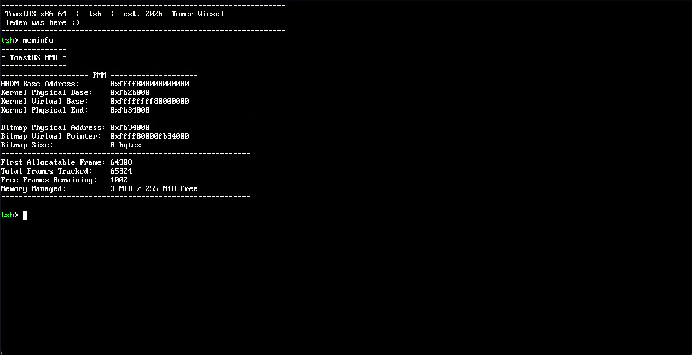

# ToastOS

A hobby operating system built from scratch, starting from a bare-metal kernel and progressing toward a fully featured OS.

---

## Overview

I've always been interested in low-level programming and have wanted to learn how operating systems actually work for a long time. This project is my way of teaching myself those concepts hands-on.

ToastOS is an x86 operating system built from the ground up. The plan is to start with a minimal kernel capable of printing text, then work toward memory management, filesystems, networking, and eventually a graphical interface.

Development follows 10 core stages, each building on the last.

---

## Roadmap

| Stage | Name | Status |
|-------|------|--------|
| 1 | Shell | Complete |
| 2 | Dynamic Memory Allocation | Done|
| 2.5 | Transition to 64-bit | Done |
| 3 | Multitasking and Ring 3
| 4 | Main and boot partition file systems
| 5 | Usermode stdlib (mussl or glibc)
| 6 | System-call layer
| 7 | Running Software (bash, Doom, etc.) |  |
| 8 | GUI |  |
| 9 | Device drivers (sound, networking card)
| 10 | Networking |  |

---

## Stage Details

### Stage 1 — Shell (Complete)

**Goal:** Implement the foundational layer needed for a functional text-based shell.

Completed components:
- 256 color graphics on a beautiful Linear framebuffer
- `printf` implementation
- Global Descriptor Table (GDT)
- Interrupt Descriptor Table (IDT)
- PS/2 keyboard driver
- Basic shell: command input, output, scrolling, and clearing

Below is a screenshot of the shell running, showing the welcome banner and the output of the meminfo command, showing a cheat sheet of the memory management layer so far(still in progress being ported from the 32 bit branch).

---

### Stage 2 — Dynamic Memory Allocation (Complete)

The pmm is implemented as a bitmap positioned after the kernel, followed by the kernel heap. The vmm uses a 4 layer paging schema and ditches the old recursive mapping algorithm for a more streamlined walk through the memory map provided by limine.

I wrote a generic heap_t struct so that later on I can add per process heaps down the line.
 
Note: I know bitmaps may not be the most efficient algorithm (seeing as they can lead to O(n) search for free space), but for now the main concern was learning the fundementals of building an mmu. I might switch to something like the buddy system in the future.
---

### Stage 2.5 — Transition to 64-bit (Complete!)

The migration was done layer by layer. First building
a new corss compiler, then swapping out the vga driver for 
both a linear framebuffer and font drivers as we can no longer
benefit from the hardcoded text buffer at 0xB800.

IDT and GDT were basically the same aside from the struct rewrite
as they now took more space and threw out some old fields.

When it came to the mmu I made more concrete changes. For starters I swapped out my hacked together storage allocator for dlmalloc. While it was fun to experiment with the old version, I wanted something compact, stable, and efficient that wouldn't cause problems and need much scaling down the line(aside from some initial adjustments for porting). A storage allocator can be a project on it's own and seeing as my main goal with this project is to learn os development and about x86 architecture, and not storage allocation algorithms, I decided to utilize a well known and well written  allocator instead to save me the massive headache that rolling my own would have led to.

Also added a proper kernel panic(finally) and started expanding the idividual exception handlers for better/more informative debugging.

---

## Resources & References

### Official Documentation

| Resource | URL |
|----------|-----|
| OSDev Wiki | https://wiki.osdev.org/Expanded_Main_Page |
| Multiboot Specification | https://www.gnu.org/software/grub/manual/multiboot/html_node/multiboot_002eh.html |

### Tutorials & Books

| Resource | URL |
|----------|-----|
| OSDev Tutorial Archive | http://www.osdever.net/tutorials/ |
| Bran's Kernel Development Tutorial | http://www.osdever.net/bkerndev/Docs/intro.htm |
| The Little OS Book | https://littleosbook.github.io |

### Code & Implementations

| Resource | Description | URL |
|----------|-------------|-----|
| `printf` by Scott Cosentino | stdio implementation used as reference before being modified for 64 bit | https://gitlab.com/olivestem/Jazz2-0/-/blob/main/src/stdlib/stdio.c |
| `Malloc` by Doug Lea | I chose to use dlmalloc for general puropose storage allocation as I heard it was quite portable and efficient, not to mention simple to port. |

https://gee.cs.oswego.edu/dl/html/malloc.html

 https://gee.cs.oswego.edu/pub/misc/malloc.c |

---

## Credits

- **Author:** Tomer Wiesel
- Initial `printf` implementation by Scott Cosentino. Has since been modified for 64 bit
- OSDev community for documentation and tutorials
- Doug Lea's `malloc`
