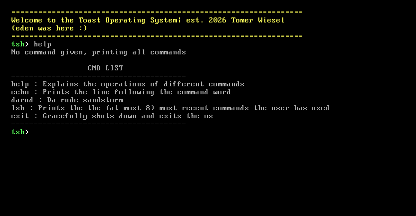

# ToastOS

A hobby operating system built from scratch, starting from a bare-metal kernel and progressing toward a fully featured OS.

---

## Overview

I've always been interested in low-level programming and have wanted to learn how operating systems actually work for a long time. This project is my way of teaching myself those concepts hands-on.

ToastOS is an x86 operating system built from the ground up. The plan is to start with a minimal kernel capable of printing text, then work toward memory management, filesystems, networking, and eventually a graphical interface.

Development follows 10 core stages, each building on the last.

---

## Roadmap

| Stage | Name | Status |
|-------|------|--------|
| 1 | Shell | Complete |
| 2 | Dynamic Memory Allocation | Done|
| 2.5 | Transition to 64-bit | In progress |
| 3 | Multitasking and Ring 3
| 4 | Main and boot partition file systems
| 5 | Usermode stdlib (mussl or glibc)
| 6 | System-call layer
| 7 | Running Software (bash, Doom, etc.) | Upcoming |
| 8 | GUI | Upcoming |
| 9 | Device drivers (sound, networking card)
| 10 | Networking | Upcoming |

---

## Stage Details

### Stage 1 — Shell (Complete)

**Goal:** Implement the foundational layer needed for a functional text-based shell.

Completed components:
- VGA text-mode driver
- `printf` implementation
- Global Descriptor Table (GDT)
- Interrupt Descriptor Table (IDT)
- PS/2 keyboard driver
- Basic shell: command input, output, scrolling, and clearing

Below is a screenshot of the shell running, showing the welcome banner and the built-in `help` command listing available commands (`help`, `echo`, `darud`, `lsh`, `exit`).

---

### Stage 2 — Dynamic Memory Allocation (Complete)

**Goal:** Implement dynamic memory management and support for a few basic filesystems (ext2, FAT32).

#### Page Frame Allocator (Complete)

Recently finished implementing a bitmap-based page frame allocator. Key details:

- The allocator reads the memory map provided by the Multiboot bootloader to determine available physical memory.
- A bitmap tracks the allocation state of each 4KB page frame (1 bit per frame).
- The bitmap itself is placed directly after the kernel in memory, followed by the initial page allocation stack.
- Page tables are reconfigured after initialization to correctly map the kernel and bitmap regions.

Tested in the Bochs debugger, which confirmed correct page table configuration after initialization. The kernel reports 8,176 tracked frames with the bitmap positioned at `0x010b960` and the first available physical frame at `0x10c000`.

Note: a bitmap isn't the most efficient approach, but the goal was to understand how page frame allocation and recursive mapping work before attempting something more complex. A different algorithm (such as the buddy system) may be worth revisiting later.

#### Working Kernel Heap!

Today (June 12, 2026) I ran the first successful dynamic memory allocation test!

#### Next Up: PDT Sync

With physical frame allocation in place, the next step is implementing **page directory table (PDT) synchronization**, to keep page directories consistent across contexts. This lays the groundwork for supporting userspace page tables down the line.

---

### Stage 2.5 — Transition to 64-bit (In progress)

Move the kernel from 32-bit protected mode to 64-bit long mode.

---

## Resources & References

### Official Documentation

| Resource | URL |
|----------|-----|
| OSDev Wiki | https://wiki.osdev.org/Expanded_Main_Page |
| Multiboot Specification | https://www.gnu.org/software/grub/manual/multiboot/html_node/multiboot_002eh.html |

### Tutorials & Books

| Resource | URL |
|----------|-----|
| OSDev Tutorial Archive | http://www.osdever.net/tutorials/ |
| Bran's Kernel Development Tutorial | http://www.osdever.net/bkerndev/Docs/intro.htm |
| The Little OS Book | https://littleosbook.github.io |

### Code & Implementations

| Resource | Description | URL |
|----------|-------------|-----|
| `printf` by Scott Cosentino | stdio implementation used as reference | https://gitlab.com/olivestem/Jazz2-0/-/blob/main/src/stdlib/stdio.c |

---

## Credits

- **Author:** Tomer Wiesel
- `printf` implementation by Scott Cosentino
- OSDev community for documentation and tutorials
