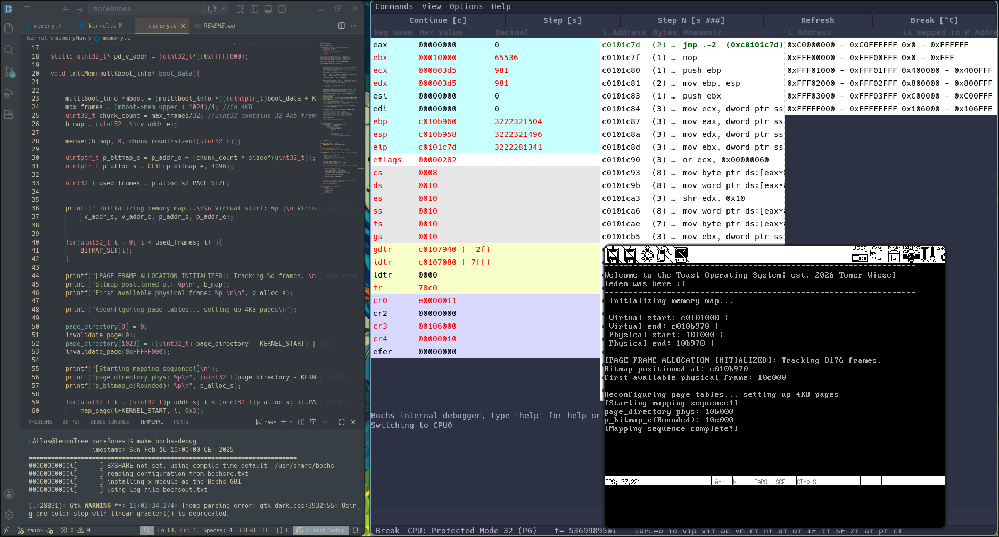

# ToastOS

> My hobby operating system built from scratch, with the goal of starting from a bare-metal kernel and progressing toward a fully featured OS.

---

## Overview

So here's the sitch', I love low level programming, and have been wanting to learn about operating system concepts and how they work for a very long time now. Through this project, I will teach myself
these very things.

ToastOS is an x86 operating system I am building from the ground up. The goal is to start from a minimal kernel capable of printing text, and working toward memory management, filesystems, networking, and eventually a graphical interface.

My (current) development plan follows five core stages, each building on the last.

---

## Roadmap

| Stage | Name | Status |
|-------|------|--------|
| 1 | Shell | ✅ Complete |
| 2 | Memory Allocation & File System | 🔄 In Progress |
| 2.5 | Transition to 64-bit | ⏳ Upcoming |
| 3 | Networking | ⏳ Upcoming |
| 4 | Running Software (bash, Doom, etc.) | ⏳ Upcoming |
| 5 | GUI | ⏳ Upcoming |

---

## Stage Details

### Stage 1 — Shell ✅
**Goal:** Implement the foundational layer needed for a functional text-based shell.

Completed components:
- VGA text-mode driver
- `printf` implementation
- Global Descriptor Table (GDT)
- Interrupt Descriptor Table (IDT)
- PS/2 Keyboard driver
- Basic shell: command input, output, scrolling, and clearing

---

### Stage 2 — Memory Allocation & File System 🔄

**Goal:** Implement dynamic memory management and support for a few basic filesystems (ext2, FAT32).

#### ✅ Page Frame Allocator (Complete)

Just recently, I've finished implementing a **bitmap-based page frame allocator**. Key details:

- The allocator reads the memory map provided by the Multiboot bootloader to determine available physical memory.
- A bitmap tracks the allocation state of each 4KB page frame (1 bit per frame).
- The bitmap itself is placed directly after the kernel in memory, followed by the initial page allocation stack.
- Page tables are reconfigured after initialization to correctly map the kernel and bitmap regions.

The screenshot below shows the allocator running successfully, using the Bochs debugger to display the updated page table configuration.

*Bochs debugger view: register state (left), assembly disassembly (center), and kernel output confirming successful memory map initialization (right). The kernel reports 8,176 tracked frames with the bitmap positioned at `0x010b960` and the first available physical frame at `0x10c000`.*

PS: I know that bitmaps aren't exactly efficient, but I wanted to understand how page frame allocation and recursive mapping work without throwing myself at something super complicated first. The goal was to learn how it's supposed to work and implement it. Maybe in the future, I shall implement a different algorithm such as the buddy system.

#### ⏳ Next Up: `kmalloc`

With physical frame allocation in place, the next step is implementing **`kmalloc`** — a kernel heap allocator that will allow dynamic memory allocation within the kernel, analogous to `malloc` in userspace. This will lay the groundwork for more complex data structures and eventually a filesystem.

---

### Stage 2.5 — Transition to 64-bit ⏳
Move the kernel from 32-bit protected mode to 64-bit long mode.

---

### Stage 3 — Networking ⏳
Implement a basic network stack.

---

### Stage 4 — Running Software ⏳
Target: run existing software such as `bash` or Doom.

---

### Stage 5 — GUI ⏳
Implement a graphical user interface.

---

## Resources & References

### Official Documentation
| Resource | URL |
|----------|-----|
| OSDev Wiki | https://wiki.osdev.org/Expanded_Main_Page |
| Multiboot Specification | https://www.gnu.org/software/grub/manual/multiboot/html_node/multiboot_002eh.html |

### Tutorials & Books
| Resource | URL |
|----------|-----|
| OSDev Tutorial Archive | http://www.osdever.net/tutorials/ |
| Bran's Kernel Development Tutorial | http://www.osdever.net/bkerndev/Docs/intro.htm |
| The Little OS Book | https://littleosbook.github.io |

### Code & Implementations
| Resource | Description | URL |
|----------|-------------|-----|
| `printf` by Scott Cosentino | stdio implementation used as reference | https://gitlab.com/olivestem/Jazz2-0/-/blob/main/src/stdlib/stdio.c |

---

## Credits

- **Author:** Tomer Wiesel
- `printf` implementation by **Scott Cosentino**
- OSDev community for documentation and tutorials
